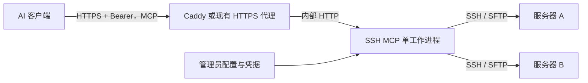

# 部署说明

## 连接结构



当前只使用一个工作进程或副本：SSH 通道和输出保存在内存，没有跨实例会话存储或路由。
重启服务会结束连接。MCP 主机必须能够访问每台目标服务器的 SSH 端口。

<a id="host-key-enrollment"></a>

## 核验主机密钥

1. 通过可信渠道取得目标 SSH 主机公钥指纹，例如云控制台、已有已验证 SSH 连接或管理员。
2. 在操作者或 MCP 主机收集候选公钥，例如 `ssh-keyscan -p 22 staging.example.com > candidate_hosts`。
3. 将 `ssh-keygen -lf candidate_hosts` 的结果与可信指纹比较。
4. 只有匹配后，才把公钥追加到配置的 `known_hosts`。

单独执行 `ssh-keyscan` 不足以建立信任。非默认端口使用 `[hostname]:port` 条目。
条目中的主机名/IP 必须匹配配置目标。本产品不提供跳过验证的选项。

## Docker Compose 与独立 HTTPS 入口

默认模板要求一个指向部署服务器的专用主机名，以及可供 Caddy 使用的 80/443 端口。
已有代理占用这些端口时，使用下文的现有代理方案，不启动第二个监听者。

```sh
mkdir -p deploy/config/secrets
cp config.example.json deploy/config/config.json
cp deploy/.env.example deploy/.env
```

编辑 `deploy/config/config.json`：

- 容器内的 `http.listen_host` 设置为 `0.0.0.0`。
- `http.public_url` 设置为实际 HTTPS 地址，例如 `https://ssh-mcp.example.com`。
- 替换或删除示例目标；凭据路径放在 `/config` 内，使用相对 `secrets/...` 或绝对 `/config/secrets/...`。
- 把所需私钥和已经核验的 `known_hosts` 放入 `deploy/config/secrets`。

编辑 `deploy/.env`，设置相同的 `SSH_MCP_DOMAIN`，分别生成随机且不同的 `SSH_MCP_TOKEN`
和 `SSH_MCP_ADMIN_TOKEN`，只保留配置实际引用的 SSH 密码/口令环境变量。
可以用 `ssh-mcp generate-token`，或 `python3 -c 'import secrets; print(secrets.token_urlsafe(48))'` 生成 Token。
真实配置、`.env`、服务器清单和私钥不能提交到仓库。

应用容器以 UID/GID `10001` 运行，需要能读取自己的配置和密钥。
以下权限命令仅用于专门创建的 `deploy/config` 目录：

```sh
sudo chown -R 10001:10001 deploy/config
sudo chmod 700 deploy/config/secrets
sudo chmod 600 deploy/config/secrets/*
chmod 600 deploy/.env
docker compose -f deploy/compose.yaml --env-file deploy/.env build
docker compose -f deploy/compose.yaml --env-file deploy/.env run --rm ssh-mcp check --config /config/config.json --database /data/ssh-mcp.sqlite3
docker compose -f deploy/compose.yaml --env-file deploy/.env up -d
```

只向主机暴露 Caddy 的端口，MCP 应用留在 Compose 内部网络。
不要增加公网 `8000:8000` 映射。代理应保留公开 Host，SSH MCP 会校验 Host 及请求携带的 Origin。

不带认证访问公开 `/mcp` 应返回 **401**；真正的就绪检查是带认证完成 MCP 初始化和 `list_servers`。
只有 401 并不能证明 SSH 连接或完整 MCP 调用正常。

## 复用已有 HTTPS 代理

Docker 部署使用独立的 [现有代理 Compose 文件](../deploy/compose.existing-proxy.yaml)，
替代 `compose.yaml`，不要把两个文件组合使用。
它不启动 Caddy，也不绑定 80/443；只把应用映射到主机 `127.0.0.1:18080`。
先核实端口空闲，必要时在 `deploy/.env` 设置 `SSH_MCP_LOCAL_PORT`。
应用容器内仍监听 `0.0.0.0`，`http.public_url` 填实际 HTTPS 源地址。

```sh
docker compose -p ssh-mcp -f deploy/compose.existing-proxy.yaml --env-file deploy/.env build
docker compose -p ssh-mcp -f deploy/compose.existing-proxy.yaml --env-file deploy/.env run --rm ssh-mcp check --config /config/config.json --database /data/ssh-mcp.sqlite3
docker compose -p ssh-mcp -f deploy/compose.existing-proxy.yaml --env-file deploy/.env up -d
```

凭据权限和 Token 准备与前文相同。主机级代理转发到 `http://127.0.0.1:18080` 或选定端口，保留 Host 和路径。
若代理也在容器内，其 `127.0.0.1` 并不是主机，需要明确配置共享私有 Docker 网络。
修改共享代理前，检查已有监听和路由并备份，验证配置通过后才重载，随后复查原有应用健康。

没有域名时，可以使用覆盖公网 IP 的可信证书提供 HTTPS。
复用已有 IP 入口前先核实证书覆盖范围和续期方式。
若根路径与现有应用冲突，可在端口允许且客户端支持的前提下设置独立 HTTPS 监听。
`http.public_url` 必须包含实际的非标准端口。
不要关闭 TLS 验证；当前控制台要求 `/console`、`/admin/`、`/mcp` 位于源地址根路径，不能直接假设任意子路径可用。

依赖和构建流程见 [可复现安装与构建](reproducible-builds.md)。

## 原生进程与 systemd

把项目安装到 `/opt/ssh-mcp/.venv`，创建专用 `ssh-mcp` 系统账户，
配置和密钥放在该账户拥有的 `/etc/ssh-mcp`。
[systemd 单元](../deploy/ssh-mcp.service) 从受保护的 `/etc/ssh-mcp/ssh-mcp.env` 加载秘密。
单元启用了 `ProtectHome=true`，运行密钥不要放在操作者的家目录。

原生部署保留回环监听地址，由已有代理终止 TLS。
将 `/mcp`、`/console`（包括静态文件）和 `/admin/` 原路径转发到 `http://127.0.0.1:8000`，
保留 Host，允许 POST/GET/PUT/DELETE，限制请求体为 2 MiB，响应超时不少于 45 秒。
不要记录请求体或认证头。长任务采用短请求轮询，不需让代理连接保持整个命令执行时长。

## 服务器管理与凭据轮换

首次启动从 JSON 导入服务器到 SQLite，此后通过 `/console` 增删改，当前 HTTP 工作进程立即更新。
运行中的会话继续使用原连接；删除目标前必须关闭其运行会话。
JSON 仍负责运行设置，修改后重启；编辑 JSON 不会覆盖已初始化的数据库清单。

Docker 数据库位于 `ssh_mcp_data` 卷的 `/data/ssh-mcp.sqlite3`，
systemd 位于 `/var/lib/ssh-mcp/inventory.sqlite3`。
使用自定义数据库时，CLI 检查也应传入相同的 `--database`。
停止服务后备份数据库，配置与秘密另行安全备份，详见 [控制台存储规则](console.md)。

`check` 只检查配置、文件存在性及环境变量，不会连接目标，也不证明私钥能登录。
可通过 `execute_command` 执行 `id` 等简单命令核验目标。

轮换 MCP Token 时，同时更新服务环境和客户端秘密存储，再重启服务。
管理员 Token 以相同方式轮换，浏览器重新登录。
SSH 凭据在目标账户及服务端密钥文件/环境变量中同时更新后重启。
登录凭据不会出现在 `list_servers` 或配置校验输出中。

## 管理部署主机自身

将部署主机作为普通 SSH 目标配置。原生部署可使用 `127.0.0.1` 及本机 SSH 服务。
容器中的 `127.0.0.1` 指容器自身，必须使用容器实际可达的主机地址。

目标账户应无法读取 MCP 服务秘密文件或环境。同机 root 账户可以读取这些信息；
若不接受该访问能力，需要分开部署主机或设置合适的系统权限边界。

## 运维与回滚

审计写到标准错误，只包含 UTC 时间、工具名、耗时和结果类型，不记录命令、输入输出、文件正文、路径或凭据。
日志由 journald 或容器运行时保留；这是操作元数据，不是完整命令审计。

内存由会话数量及每个输出流的容量共同限制。Unicode 每字符可能占四字节，另有 Python 开销。
小型主机应调低限制。完成后的输出按 `retention_seconds` 回收，轮询不会延长保留时间。
长时间无人访问的 Shell 会过期，即使其中仍有远程命令运行。

升级前关闭或排空会话，安全备份配置和数据库，安装新版本，检查配置后重启，
再进行 MCP 初始化和临时目标检查。回滚时恢复旧程序及匹配的配置/数据库版本。
