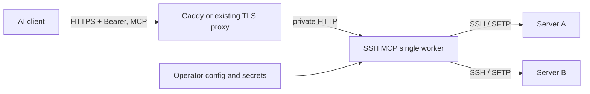

# Deployment

## Topology



Use one worker/replica: SSH channels and output live in process memory. There is
no shared-session store or distributed routing in this release. Service restarts
end active connections. The service host needs outbound access to each SSH target.

## Host-key enrollment

1. Obtain each host's SSH host-key fingerprint through a trusted channel (provider
   console, an existing verified SSH connection, or the server administrator).
2. On the operator/service machine, collect the public key, for example
   `ssh-keyscan -p 22 staging.example.com > candidate_hosts`.
3. Compare `ssh-keygen -lf candidate_hosts` with the trusted fingerprints.
4. Only after they match, append the verified lines to the configured `known_hosts`.

`ssh-keyscan` alone does not establish trust. Non-default ports use
`[hostname]:port` entries. The hostname/IP in the entry must match the configured
target. SSH MCP intentionally has no `insecure_skip_verify` option.

## Docker Compose with HTTPS

The templates assume a dedicated hostname pointing at the deployment server, and
ports 80/443 available for Caddy certificate issuance and HTTPS. If an existing
proxy owns those ports, integrate with it rather than starting a second listener.

```sh
mkdir -p deploy/config/secrets
cp config.example.json deploy/config/config.json
cp deploy/.env.example deploy/.env
```

Edit `deploy/config/config.json`:

- Set `http.listen_host` to `0.0.0.0` **inside the container**.
- Set `http.public_url` to `https://your-actual-hostname`.
- Replace/remove example targets. Keep credential paths under `/config`, using
  relative `secrets/...` paths or absolute `/config/secrets/...` paths.
- Copy the needed private keys and verified `known_hosts` into `deploy/config/secrets`.

Edit `deploy/.env`: set the same `SSH_MCP_DOMAIN`, independent random `SSH_MCP_TOKEN`
and `SSH_MCP_ADMIN_TOKEN` values, and
only the SSH password/passphrase variables referenced in your configuration.
Generate a token with the installed `ssh-mcp generate-token`, or
`python3 -c 'import secrets; print(secrets.token_urlsafe(48))'`.
Never commit `.env`, actual config, host inventories or private keys.

The application container runs as UID/GID `10001`. Arrange ownership so it can
read its configuration and key files; on Linux, an example for this dedicated directory is:

```sh
sudo chown -R 10001:10001 deploy/config
sudo chmod 700 deploy/config/secrets
sudo chmod 600 deploy/config/secrets/*
chmod 600 deploy/.env
docker compose -f deploy/compose.yaml --env-file deploy/.env build
docker compose -f deploy/compose.yaml --env-file deploy/.env run --rm ssh-mcp check --config /config/config.json --database /data/ssh-mcp.sqlite3
docker compose -f deploy/compose.yaml --env-file deploy/.env up -d
```

Compose exposes only Caddy's ports to the host. The MCP service port remains on
the internal Compose network. Do not add a public `8000:8000` mapping. Caddy must
preserve the public Host header; SSH MCP checks Host and any supplied Origin.

The health check for authentication is an unauthenticated request to
`https://your-actual-hostname/mcp`: it must return **401**. A successful authenticated
MCP initialization and `list_servers` are the readiness checks; a 401 alone proves
neither SSH connectivity nor a complete MCP exchange.

## Native service / existing reverse proxy

For Docker behind an existing **host-level** TLS proxy, use the standalone
[existing-proxy Compose file](../deploy/compose.existing-proxy.yaml) instead of
`compose.yaml`. It does not launch Caddy or bind ports 80/443. It publishes the
application only on `127.0.0.1:18080`; set `SSH_MCP_LOCAL_PORT` in `deploy/.env` if
that port is already in use. Keep the application listen address `0.0.0.0` inside
the container and configure the real HTTPS origin in `http.public_url`.

```sh
docker compose -p ssh-mcp -f deploy/compose.existing-proxy.yaml --env-file deploy/.env build
docker compose -p ssh-mcp -f deploy/compose.existing-proxy.yaml --env-file deploy/.env run --rm ssh-mcp check --config /config/config.json --database /data/ssh-mcp.sqlite3
docker compose -p ssh-mcp -f deploy/compose.existing-proxy.yaml --env-file deploy/.env up -d
```

Use the same private config/key ownership and token setup described above. Proxy
to `http://127.0.0.1:18080` (or the selected port), preserving the public Host and
request paths. A containerized proxy cannot use the host's loopback address as its
own loopback; use a deliberately shared private Docker network in that case.
Before changing any shared proxy, inspect its current listeners/routes, save a
backup, validate the changed configuration and reload only after validation passes.
Verify existing applications remain healthy after the change.

Without a domain, a trusted certificate covering the public IP can provide HTTPS.
Verify certificate coverage and renewal before reusing an existing IP endpoint.
If its routes conflict with the existing application, a separate HTTPS listener
can provide a distinct origin, subject to port availability and client support.
Set that exact origin, including any nonstandard port, in `http.public_url`.
Do not disable TLS verification or assume an arbitrary URL subpath works: this
console currently expects `/console`, `/admin/` and `/mcp` at the origin root.

For a native service:

Install the project in `/opt/ssh-mcp/.venv`, create a dedicated `ssh-mcp` OS user,
and put configuration and keys under `/etc/ssh-mcp` owned by that account.
The supplied [systemd unit](../deploy/ssh-mcp.service) loads secrets from a protected
`/etc/ssh-mcp/ssh-mcp.env` and binds according to your config. It uses
`ProtectHome=true`, so do not place runtime keys in an operator home directory.

Keep the default loopback listen address. Terminate TLS at the existing proxy,
preserve Host, forward `/mcp`, `/console` (including assets) and `/admin/` to the
same paths on `http://127.0.0.1:8000`, allow POST/GET/PUT/DELETE,
set a 2 MiB request body limit and a response timeout of at least 45 seconds.
Disable request-body/header logging. Long commands are polled in short requests,
so the proxy does not need to hold a connection for the full command duration.

## Server management and rotation

The first startup imports JSON targets into SQLite. After that, add, edit and
delete targets in `/console`; changes update the current HTTP worker immediately.
Existing SSH sessions keep their connections, and running sessions must be closed
before removing a target. JSON remains the source of runtime settings, which need
a restart. JSON edits do not overwrite the initialized database inventory.

Docker persists SQLite in the `ssh_mcp_data` volume at `/data/ssh-mcp.sqlite3`;
systemd uses `/var/lib/ssh-mcp/inventory.sqlite3`. Pass the same `--database` path
to CLI checks when using a custom location. Back up the database with the service
stopped, alongside private configuration and secrets. See [console storage rules](console.md).

`check` validates configuration, referenced file existence and secret availability;
it does **not** connect to targets or prove a private key is accepted. Verify a new
target using `execute_command` with an innocuous command such as `id`.

Rotate the MCP token in the service environment and client secret store, then
restart the service. Rotate the independent admin token similarly and sign in
again in the browser. Rotate SSH credentials on the remote account and in the
service's key file/environment, then restart. Existing credentials never appear
in `list_servers` or validation output.

## Managing the deployment host itself

Configure that host as an ordinary SSH target. In a native deployment, use
`127.0.0.1` and the local SSH server. In Compose, `127.0.0.1` means the application
container; use a host address reachable from the container instead.

The target account must not be able to read the MCP service's secret files or
environment. A target root account on the same machine can access those secrets;
separate hosts or OS permission boundaries are required if that access is unwanted.

## Operations

Audit events go to stderr and contain a UTC timestamp, tool name, duration and outcome type.
Commands, terminal input/output, file contents,
paths and credentials are not recorded. Use journald/container logging for
retention. These logs are operational metadata, not a complete command audit.

Memory is bounded by configured sessions and per-stream buffers; Unicode can use
up to four bytes per retained character, before Python overhead. Lower limits for
small hosts. A completed process retains output for `retention_seconds` from
completion; polling does not extend that retention. Idle shells expire even if a
remote command is running inside them, unless the client keeps accessing them.

For upgrade: drain/close sessions, back up private configuration separately from
the repository, install the new release, validate configuration, restart, then
run MCP initialization and a disposable-target smoke test. For rollback, restore
the previous application version and its compatible configuration.
